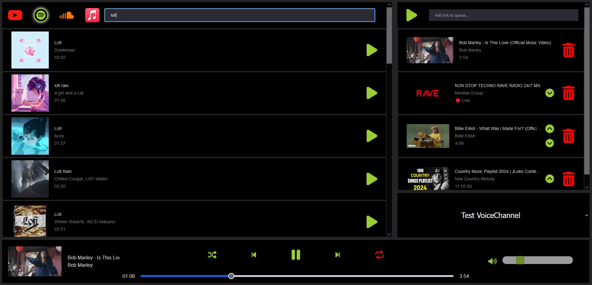
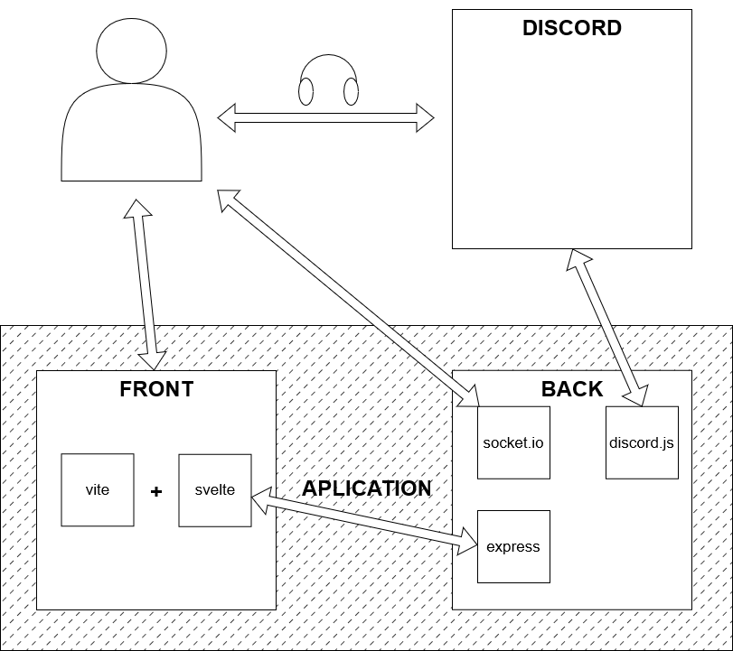
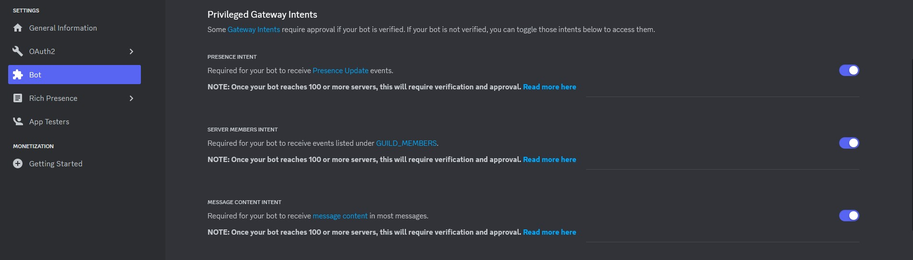
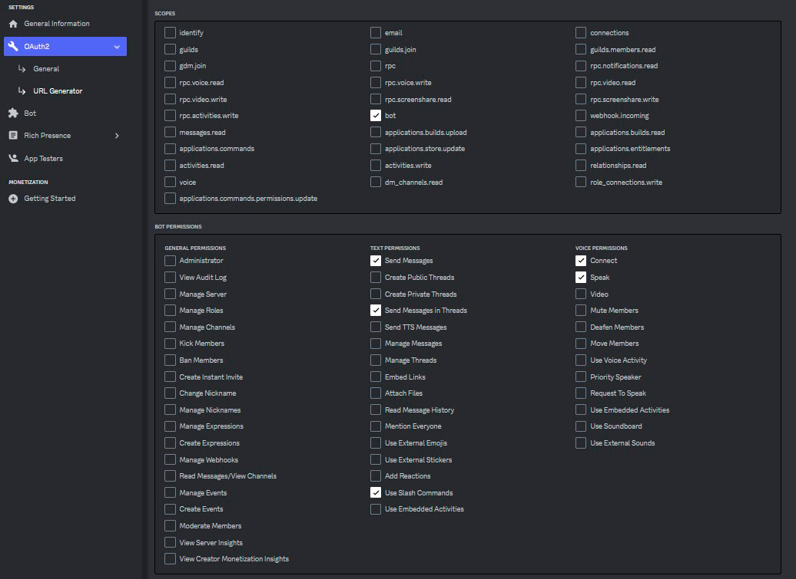

# Discord music bot with web interface

Discord Music Bot with Real-Time Web Interface Using WebSockets



This application is a comprehensive "all-in-one" solution, which deploys all necessary services with a single command.

It is built upon:

- Graphical Interface: Leveraging the robust combination of Vite and Svelte for a sleek and responsive user experience.
- API/WebSockets: A powerful trio of Express, Socket.io, and discord.js orchestrates seamless real-time communication and interaction with Discord's API.

  


***  


## 🚧 | Prerequisites
- [Node.js >= 20](https://nodejs.org/en/download/)
- [yarn](https://classic.yarnpkg.com/lang/en/docs/install/#windows-stable)
- [FFmpeg](https://ffmpeg.org/download.html)  


***  


## 📝 | Installation

- First of all you need to create a discord application in the [Discord Developer Portal](https://discord.com/developers/applications)

    - Save the token
    - Add the intents
        - PRESENCE INTENT
        - SERVER MEMBERS INTENT
        - MESSAGE CONTENT INTENT  


  


   - Generate an invite URL with proper permissions
       - bot
            - Send Messages
            - Send Messages in Threads
            - Use Slash Commands
            - Connect
            - Speak  




- Install requirements
    > This will run the command "yarn" (installation) in the server and client folders
```
yarn installation
```

- Configuration
    - Environment variables
    - Copy the ".env.example" file to ".env" and fill in the values
    ```
    TOKEN=                          // Bot Secret Token
    ACTIVITY_TYPE=Listening         // Activity of the bot: "Streaming", "Listening", "Watching", "Playing"
    ACTIVITY=music                  // Text after the activityType, this example output: Listening to music
    DOMAIN=http://localhost:5178    // The domain where you will be running the application, default "localhost", and default port 5178
    PORT=5178                       // The port where you will be running the application, default 5178
    ```
- Start
    > This will launch the server and the client
```
yarn start
```  


***  


## 🐳 | Docker
> **You can find 2 previous builds on Docker Hub:**  

[Link to DockerHub repository](https://hub.docker.com/repository/docker/borrageiros/discord-music-bot/tags)

- **latest**: for amd64 distributions  
    ```
    borrageiros/discord-music-bot:latest
    ```

- **arm64**: for arm64 distributions  
    ```
    borrageiros/discord-music-bot:arm64
    ```  

Example command:

```
docker run -d \
    --name=discord-music-bot \
    -p 3000:5178 \
    -e DOMAIN=http://localhost:3000 \
    -e TOKEN=thisisasecrettoken \
    -e ACTIVITY_TYPE=Listening \
    -e ACTIVITY="music" \
    borrageiros/discord-music-bot:latest
```  


***  


## ℹ | Info
> **🔴Default ports of the application:**

- Dev interface: 5173

- Interface / API / WebSockets: 5678

- The server displays the web interface build located in the 'interface' folder. To run the application, you must first build the interface. Both the "npm install" and "npm start" commands check this folder before running the application and automatically execute the interface build to prevent errors.

- Avaliable commands:

```
{
    "installation": "yarn install && cd client && yarn install && yarn build",
    "prestart": "test -d interface || yarn build:client",
    "start": "node src/index.js",
    "build:client": "cd client && yarn build",
    "dev:client": "cd client && yarn dev",
    "dev:server": "nodemon src/index.js"
}
```  

- Enviorment variables for dev:  

```
SKIP_UPDATE_COMMANDS=true/false     // Skip the update the commands in the discord applicationGuildCommands (slash commands showed in discord interface)
DELETE_PREVIUS_COMMANDS=true/false  // Delete the previous commands in the discord applicationGuildCommands (slash commands showed in discord interface) (Only works if SKIP_UPDATE_COMMANDS=true)
```  

***


## 👾 | Discord commands/integration
> **Apart from the interface, there are some commands to control the bot directly from Discord:**  

- **/link**  
    Send to the channel a link to open the web reproducer

- **/nowplaying**  
    See which song is currently playing

- **/pause**  
    Pauses the current song

- **/play**  
    Play music by the given song name or song link

- **/queue**  
    Shows the current queue

- **/repeat**  
    Toggle the repeat loop mode

- **/resume**  
    Resumes the current song

- **/shuffle**  
    Toggle the shuffle mode on the current queue

- **/skip**  
    Skip the current playing song

- **/volume**  
    Change current playing volume